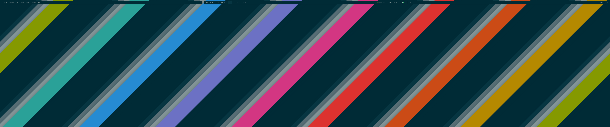
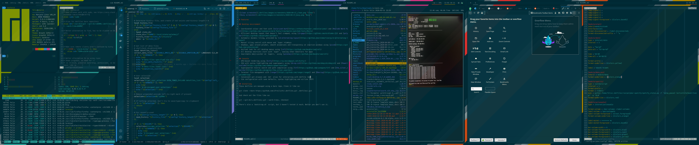
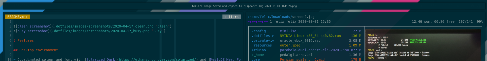

# iFreilicht's dotfiles





# Features 

## Desktop environment

- Coordinated colour and font with [Solarized Dark](https://ethanschoonover.com/solarized/) and [MesloDZ Nerd Font](https://github.com/ryanoasis/nerd-fonts/tree/master/patched-fonts/Meslo)
- Efficient desktop layout that doesn't feel cramped, using [i3-gaps](https://github.com/Airblader/i3) and [polybar](https://github.com/polybar/polybar)
- Automatic dynamic tiling, provided by [i3-alternating-layout](https://github.com/olemartinorg/i3-alternating-layout)
- Manual tiling control with mouse and `Super`+VimKeys
- Shadows, gaps around polybar, smooth animations and transparency on inactive windows using [picom](https://github.com/yshui/picom)
- Unified look for all desktop menus using [rofi](https://github.com/davatorium/rofi)
- All desktop shortcuts start with `Super`, leaving other modifiers for apps
- Searchable emoji-picker on `Super+.` using [splatmoji](https://github.com/cspeterson/splatmoji)
- Quick calculator on `Super+C` using [rofi-calc](https://github.com/svenstaro/rofi-calc)
- Conventient screenshots on `PrintScr` using [teiler](https://github.com/carnager/teiler) 

## Console
- GPU-based rendering using [kitty](https://sw.kovidgoyal.net/kitty/)
- ZSH with syntax highlighting and superpowers using [oh-my-zsh](https://github.com/ohmyzsh/ohmyzsh) and [Powerlevel10k](https://github.com/romkatv/powerlevel10k)
- Superpowered reverse search and path completion using [fzf](https://github.com/junegunn/fzf) and [the_silver_searcher](https://github.com/ggreer/the_silver_searcher)
- Terminal file management with [ranger](https://github.com/ranger/ranger) and [Überzug](https://github.com/seebye/ueberzug)
- Convenient git aliases and `dot` alias for interacting with dotfile repo
- Vim configuration with sane defaults, syntax highlighting and airline (WIP)

## Installing
These dotfiles are managed using a bare repo. Clone it like so:
```
git clone --bare git@github.com:iFreilicht/.dotfiles.git .dotfiles/.git
```
And check out the files like so:
```
git --git-dir=.dotfiles/.git --work-tree=. checkout
```
There's also a `bootstrap.sh` script, but I haven't tested it much. Better you don't use it.

To install all the tools that are required, install nix first.
Then, simply install everything from `tools.nix`:
```
nix-env -if tools.nix
```