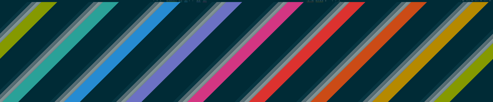
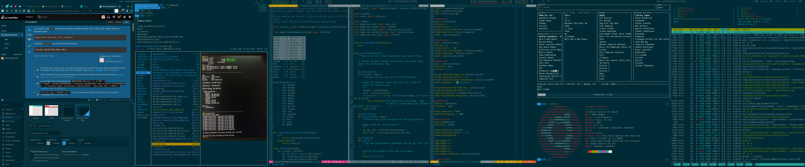

# iFreilicht's dotfiles




## Installing
These dotfiles are managed using a bare repo. Clone it like so:
```
git clone --bare https://github.com/iFreilicht/.dotfiles.git .dotfiles/.git
```
And check out the files like so:
```
git --git-dir=.dotfiles/.git --work-tree=. checkout
```
There's also a `bootstrap.sh` script, but I haven't tested it much. Better you don't use it.

